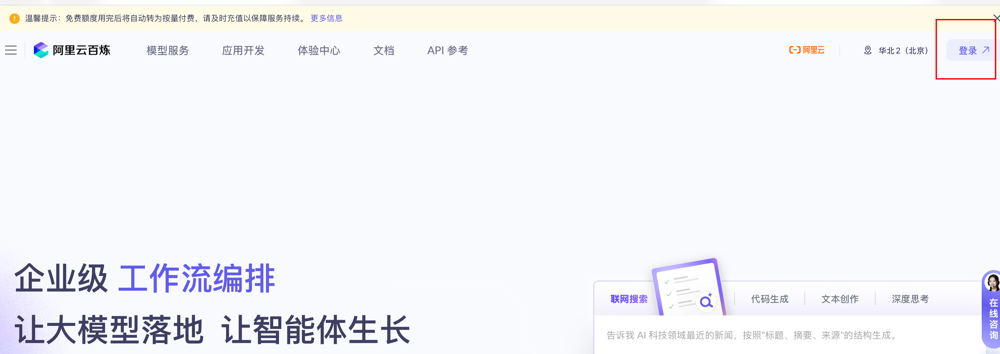
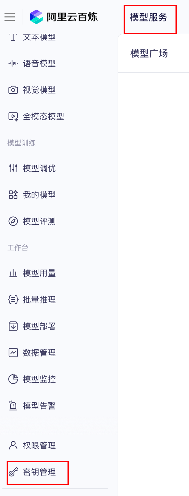
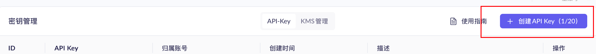

## 🔑 如何获取通义千问（Qwen）API Key

通义千问的 API 由阿里云 **百炼** 平台提供。请按以下步骤获取你的 API Key：

### 1. 访问 阿里云百炼

打开浏览器，访问：[https://bailian.console.aliyun.com/](https://bailian.console.aliyun.com/)

> 💡 你需要一个阿里云账号（可用淘宝/1688账号登录）

### 2. 点击登录



### 3. 点击模型服务，进入到密钥管理




### 4. 创建 API Key



- 在左侧菜单点击 **“API Key 管理”**
- 点击 **“创建 API Key”** 按钮
- 复制生成的密钥（格式如：`sk-xxxxxxxxxxxxxxxxxxxxxxxxxxxxxx`）

### 5. 填入 `.env` 文件

将密钥填入项目根目录的 `.env` 文件中：

```env
QWEN_API_KEY=sk-你的密钥在这里
```

⚠️ 注意：不要将 .env 提交到 Git！它已在 .gitignore 中被忽略。
